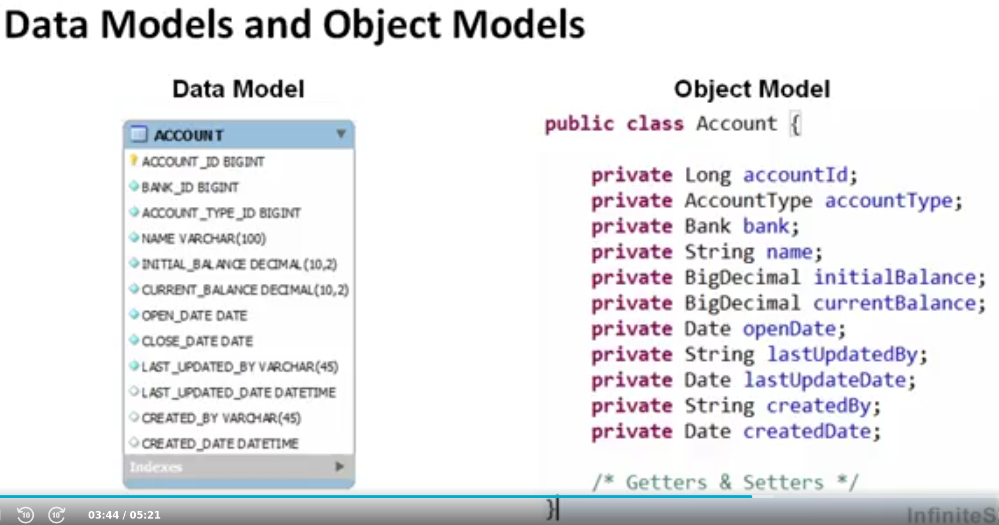

# Hibernate Course

Class: Self Study

Course URL: https://learning.oreilly.com/videos/hibernate-and-java/9781771373494/9781771373494-video209947/

## Intructions to run MYSQL Database
To start the MYSQL Database use:

```bash
docker-compose up -d
```

## Hibernate and Object Relational Mapping

### Hibernate Overview

- Implements the JPA specification.
- Contains a HQL which is used to query entities.

### Hiberanate Technical Overview

- Hibernate Configuration File, specify the connection with other hibernate properties
- Annotate entities with mapping metada (XML or Annotations)

### Benefits

- Obtain in a Session with a Session Factory and invoke persistence methods
- Removes unwieldy SQL
- Reduces development time
- Reduces lines of code
- Increases maintainability
- Increases portability by absracting the RDMS
- Well documented and established framework
- Automates the persistence of objects in Java to the tables ina  relational database, using metadata.

---

## Object Relational Mapping

### Relational Databases

- Collectives set of multiple data sets organized by tables, records and columns
- Records in one table relate to one or many records in another table to form functional dependencies established by keys



### Data Model vs Object Model


---

## Getting Started With Hibernate

### Basic Annotations

- `@Entity`→ Represents a table of the Database. Signals to hibernate that the entity maybe used in the session.
- `@Table` → Specify with which table we are going to "communicate"
- `@Column` → Name of the column, but you can use the name of the field in the class.

### Field vs Property Access

Field: When hibernate try to access to the table with the name of the attribute or the name assigned in the column notation.

```java
package com.infiniteskills.data.entities;

import javax.persistence.*;
import java.util.Date;

@Entity
@Table (name="finances_user")
public class User {
    @Id
    @GeneratedValue(strategy = GenerationType.IDENTITY)
    @Column(name = "USER_ID")
    private Long user_id;
    
    public Long getUser_id() {
        return user_id;
    }

    public void setUser_id(Long user_id) {
        this.user_id = user_id;
    }
}
```

Property Access: Uses de get or set methods to retrieve data. In the get and set methods we can use business logic and Hibernate retrieve this behavior. You respect encapsulation

```java
package com.infiniteskills.data.entities;

import javax.persistence.*;
import java.util.Date;

@Entity
@Table (name="finances_user")
public class User {
    private Long user_id;

    @Id
    @GeneratedValue(strategy = GenerationType.IDENTITY)
    @Column(name = "USER_ID")
    public Long getUser_id() {
        return user_id;
    }

    public void setUser_id(Long user_id) {
        this.user_id = user_id;
    }
}
```

- `@Access(value = AccessType.*PROPERTY*)` → Specify what type of access you are using, in this case Property
- `@Access(value = AccessType.*FIELD*)` → Specify that the access is Field

### Column Annotation

Decide when Hibernate insert a row when insert or u

- Insertable:
- Updatable: When I update, I do not update a field.
- Nullable: Prevent nulls to be persisting to the data base. Also prevents the DB throw the Exception, Hibernate throws this.
    - @Basic → Will not specify not null.

### Identifiers

- `@Id`→ Field that corresponds with the pk of the table
- `@GeneratedValue` → Used to specify how we obtain the value of a particular field. Identity, Sequence
- `@SequenceGenerator(name = "user_seq",sequenceName = "USER_ID_SEQ")` → Sequence generator for Oracle DataBase.
- Table Generator Strategy → Use a intermediate table to store and generate PK.
- Auto → Automatically use the appropriate generation type, Hibernate defines it.

### Transient Annotation

Ommits a parameter of the class, not to be persist in the DataBase. @Transient

### Temporal Annotation

- TimeStamp
- Time
- Date

Is good to annotate because it allows hibernate to persist and retrieve data. Finally, avoid cast exceptions.

### Formula Annotation

- Dynamically calculate a parameter and execute a SQL statement to retrieve the data.
- You need a formula to calculate the parameter
- It wont be persist to the data base

### Basic Value Types

- Entity Types - Hace a database indentity
    - Corresponds with a database row
- Value Types - No database identity
    - Subcategories:
        - Basic (Basic value types)
        - Composite Types  (classes Addressed to the class)
        - Collection (Hold entity types and basic value types)
    - No database identity (no @Id)
    - Embedded within an entity
    - Do not define their own life cycle
- Basic Value Type
    - Map a single database value (column) to a single, non-aggregated Java Type

## Composite and Collection Value Type Mappings

### Composite Value Types

- Represent a group of values in a single Java Type
- Do not confuse with entity
- Does not have an id or table
- Only persisted or queried in the context of its parent
- Data is embedded in the source object's table

```java
@Embedded
    private Address address = new Address();
```

```java
package com.infiniteskills.data.entities;

import javax.persistence.Column;
import javax.persistence.Embeddable;

@Embeddable
public class Address {
    @Column(name = "ADDRESS_LINE_1")
    private String addressLine1 ;

    @Column(name = "ADDRESS_LINE_2")
    private String addressLine2;

    @Column(name = "CITY")
    private String city;

    @Column(name = "STATE")
    private String state;

    @Column(name = "ZIP_CODE")
    private String zipCode;

    public String getAddressLine1() {
        return addressLine1;
    }

    public Address(){}

    public void setAddressLine1(String addressLine1) {
        this.addressLine1 = addressLine1;
    }

    public String getAddressLine2() {
        return addressLine2;
    }

    public void setAddressLine2(String addressLine2) {
        this.addressLine2 = addressLine2;
    }

    public String getCity() {
        return city;
    }

    public void setCity(String city) {
        this.city = city;
    }

    public String getState() {
        return state;
    }

    public void setState(String state) {
        this.state = state;
    }

    public String getZipCode() {
        return zipCode;
    }

    public void setZipCode(String zipCode) {
        this.zipCode = zipCode;
    }

    @Override
    public String toString() {
        return "Address{" +
                "addressLine1='" + addressLine1 + '\'' +
                ", addressLine2='" + addressLine2 + '\'' +
                ", city='" + city + '\'' +
                ", state='" + state + '\'' +
                ", zipCode='" + zipCode + '\'' +
                '}';
    }
}
```

Database visualization


---

### Collection Value Types

- Can define a collection of basic or composite value types
- Composite/basic are stored in a separate collection table
- Target objects cannot be queried, persisted, merged independently

```java
@ElementCollection
@CollectionTable(name = "bank_contact", joinColumns = @JoinColumn(name = "BANK_ID"))
@Column(name = "NAME")
private Collection<String> contacts = new ArrayList<>();
```

```java
@ElementCollection
@CollectionTable(name = "bank_contact", joinColumns = @JoinColumn(name = "BANK_ID"))
@MapKeyColumn(name = "POSITION_TYPE")
@Column(name = "NAME")
private Map<String,String> contacts = new HashMap<>();
```

Database Visualization


---

### Collection of Composite Value Types

```java
@ElementCollection
@CollectionTable(name = "user_address",joinColumns = @JoinColumn(name = "USER_ID"))
@AttributeOverrides({@AttributeOverride(name = "addressLine1",column = @Column(name = "USER_ADDRESS_LINE_1")),
					@AttributeOverride(name="addressLine2",column = @Column(name = "USER_ADDRESS_LINE_2"))})
private List<Address> address = new ArrayList<>();
```

Database Visualization


---

## Entity Associations

- One to One
    - One account is associated with one set of credentials.
- One to Many
    - One account is associated with manyu transactions.
- Many to One
    - Many transactions are associated with one account.
- Many to Many
    - Many users can be associated with many accounts.

### Unidirectional One To One Association

CasadeType.All → When we persist de the credential also persist the User at the same time.

`@JoinColumn` → Use a Column name to make the association

```java
@OneToOne(cascade = CascadeType.ALL)
@JoinColumn(name = "USER_ID")
private User user;
```

### Bidirectional One To One Association

`@OneToOne(mappedBy = "user")` → The field who is mapping the relation, that have the JoinColumn annotation

```java
@OneToOne(mappedBy = "user")
private Credential credential;
```

Database Visualization


---

### Unidirectional One To Many Association

```java
@OneToMany(cascade = CascadeType.ALL)
@JoinColumn(name = "ACCOUNT_ID",nullable = false)
List<Transaction> transactions = new ArrayList<>();
```

### Bidirectional One To Many Association

```java
@OneToMany(cascade = CascadeType.ALL, mappedBy = "account")
List<Transaction> transactions = new ArrayList<>();
```

```java
@ManyToOne
@JoinColumn(name = "ACCOUNT_ID")
private Account account;
```

Database Visualization


---

### @JoinTable

```java
@OneToMany(cascade = CascadeType.ALL)
@JoinTable(name = "budget_transaction",
            joinColumns = @JoinColumn(name = "BUDGET_ID"),
            inverseJoinColumns =  @JoinColumn(name = "TRANSACTION_ID"))
private List<Transaction> transactions = new ArrayList<>();
```

Database Visualization

**Budget**

**Budget X Transaction**

**Transaction**


---

### Unidirectional Many To Many Association

```java
@ManyToMany(cascade = CascadeType.ALL)
@JoinTable(name = "user_account",
						joinColumns = @JoinColumn(name = "ACCOUNT_ID"),
            inverseJoinColumns =  @JoinColumn(name = "USER_ID"))
private Set<User> users = new HashSet<>();
```

### Bidirectional Many To Many Association

```java
@ManyToMany(cascade = CascadeType.ALL,mappedBy = "users")
private Set<Account> accounts = new HashSet<>();
```

Database Visualization

**Account**

**User X Account**

**User**


---

## Hiberante API

- Manager CRUD operations and transactions
- Understant the persistence lifecycle

### Persistence Lifecycle

State → Verb or a noun. On each state we hace object.

Transition → Actions to go to another state.


**Entity States**

- Transient - Object constructed with the new operator that is not associated with any database row
- Persistent - An entity instance associated with a database row and contained within a persistence context
    - We can save an Transient object
    - We can retrieve an object from de Database
    - Referred to a transient object to another persistent object
- Removed - An object schedule to be deleted
- Detached - Object references to an entity once associated with a closed persistence context

### Persistence Context

- Cache of all persistent entity instances
- Corresponds with a session, manipulate the persistence context.

```java
SessionFactory factory = HibernateUtil.getSessionFactory();
Session session = factory.openSession();
//Perfrom operations
session.close();
```

| Initial State | Action | End State |
| --- | --- | --- |
| None | get()
load() | Persistent |
| Transient | save()
saverOrUpdate() | Persistent |
| Persistent | delete() | Removed |
| Detached | update()
saveOrUpdate() | Persistent |
| Persistent | evict() | Detached |

### Save Method

```java
Session session = HibernateUtil.getSessionFactory().openSession();
Account account = createNewAccount();
Transaction trans1 = createNewBeltPurchase(account);
Transaction trans2 = createShoePurchase(account);
account.getTransactions().add(trans1);
account.getTransactions().add(trans2);

System.out.println(session.contains(account));
System.out.println(session.contains(trans1));
System.out.println(session.contains(trans2));
try {
	org.hibernate.Transaction transaction = session.beginTransaction();
  session.save(account);
  System.out.println(session.contains(account));
  System.out.println(session.contains(trans1));
  System.out.println(session.contains(trans2));
  transaction.commit();
  }catch (Exception e){
		e.printStackTrace();
  }finally {
		session.close();
    HibernateUtil.getSessionFactory().close();
	}
```

### Retrieving Entities

There ir two ways:

- Use the get method that have a cache and avoid the same query more than one. Also excutes the query inmediatly.If there is not an entity with that id, we recieve a null reference.

```java
Session session = HibernateUtil.getSessionFactory().openSession
	try {
	org.hibernate.Transaction transaction = session.beginTransaction
	Bank bank = (Bank) session.get(Bank.class,1L);
	System.out.println("Method Executed

	System.out.println(bank.getName());
	transaction.commit();
	}catch (Exception e){
	e.printStackTrace();
	}finally {
	session.close();
	HibernateUtil.getSessionFactory().close();
	}
```

- Load method that when you retrieve or make something with that object it excutes the query. If there is not an entity with that id, then a ObjectNotFounException from hibernate.

```java
Session session = HibernateUtil.getSessionFactory().openSession
	try {
	org.hibernate.Transaction transaction = session.beginTransaction
	Bank bank = (Bank) session.load(Bank.class,1L);            
	System.out.println("Method Executed

	System.out.println(bank.getName());
	transaction.commit();
	}catch (Exception e){
	e.printStackTrace();
	}finally {
	session.close();
	HibernateUtil.getSessionFactory().close();
	}
```

### Modifing Entities

```java
Session session = HibernateUtil.getSessionFactory().openSession();
    try {
        org.hibernate.Transaction transaction = session.beginTransaction();
        Bank bank = (Bank) session.get(Bank.class,1L);
        bank.setName("New Hope Bank");
        bank.setLastUpdatedBy("Julio Mejía");
        bank.setLastUpdatedDate(new Date());
        transaction.commit();
    }catch (Exception e){
        e.printStackTrace();
    }finally {
        session.close();
        HibernateUtil.getSessionFactory().close();
    }
```

### Removing Entities

```java
Session session = HibernateUtil.getSessionFactory().openSession();
    try {
        org.hibernate.Transaction transaction = session.beginTransaction();

        Bank bank = (Bank) session.get(Bank.class,1L); //Persistent State
        System.out.println(session.contains(bank));
        session.delete(bank); //Delete State
        System.out.println("Method Invoked");
        System.out.println(session.contains(bank));
        transaction.commit();
    }catch (Exception e){
        e.printStackTrace();
    }finally {
        session.close();
        HibernateUtil.getSessionFactory().close();
    }
```

### Reattaching Detached Entities

```java
try {
        Session session = HibernateUtil.getSessionFactory().openSession();
        org.hibernate.Transaction transaction = session.beginTransaction();
        Bank bank = (Bank) session.get(Bank.class,1L); //Persistent State
        transaction.commit();
        session.close();

        Session session2 = HibernateUtil.getSessionFactory().openSession();
        org.hibernate.Transaction transaction2 = session2.beginTransaction();

        System.out.println(session2.contains(bank));
        session2.update(bank);// Reattached the entity to the new session
        bank.setName("Test Bank");
        System.out.println("Method Invoked");
        System.out.println(session2.contains(bank));
        transaction2.commit();
        session2.close();
    }catch (Exception e){
        e.printStackTrace();
    }finally {
        HibernateUtil.getSessionFactory().close();
    }
```

### Save Or Update

```java
try {
      Session session = HibernateUtil.getSessionFactory().openSession();
      org.hibernate.Transaction transaction = session.beginTransaction();
      Bank detachedBank = (Bank) session.get(Bank.class,1L); //Persistent State
      transaction.commit();
      session.close();

      Bank transientBank = createBank();

      Session session2 = HibernateUtil.getSessionFactory().openSession();
      org.hibernate.Transaction transaction2 = session2.beginTransaction();
      session2.saveOrUpdate(transientBank);
      session2.saveOrUpdate(detachedBank);
      detachedBank.setName("Test Bank 2");
      transaction2.commit();
      session2.close();
     }catch (Exception e){
      e.printStackTrace();
     }finally {
      HibernateUtil.getSessionFactory().close();
     }
```

### Flushing The Persistence Context

Take all of the changes and sync with our Database, something similar is when we make a savepoint in the Database.

```java
Session session = HibernateUtil.getSessionFactory().openSession();
org.hibernate.Transaction transaction = session.beginTransaction();
try {
	Bank bank = (Bank) session.get(Bank.class,1L);
	bank.setName("Something Different");
  System.out.println("Calling Flush");
  session.flush(); //Force to update the state with the database
	
	bank.setAddressLine1("Another Address Line");
  System.out.println("Calling Commit");
  transaction.commit();
}catch (Exception e){
	transaction.rollback();
  e.printStackTrace();
}finally {
	session.close();
	HibernateUtil.getSessionFactory().close();
}
```

## Java Persistence API (JPA)

- Configure a JPA application
- Discover JPA Interfaces
- Learn to invoke persistence manager methods that manage CRUD operations and transactions
- Understand the similarities between Session and Entity Manager

| EntityManager | Session |
| --- | --- |
| persist() | save() |
| merge() | merge() |
| remove() | delete() |
| detach(), close(), clear() | evict(), close(), clear() |
| find(), getReference() | get(), load() |
| flush() | flush() |

### JPA Basic Code

pom.xml file to configure the dependencies 

```xml
<?xml version="1.0" encoding="UTF-8"?>
<project xmlns="http://maven.apache.org/POM/4.0.0"
         xmlns:xsi="http://www.w3.org/2001/XMLSchema-instance"
         xsi:schemaLocation="http://maven.apache.org/POM/4.0.0 http://maven.apache.org/xsd/maven-4.0.0.xsd">
    <modelVersion>4.0.0</modelVersion>

    <groupId>com.infitieskills</groupId>
    <artifactId>hibernate-course</artifactId>
    <version>1.0-SNAPSHOT</version>

    <dependencies>
        <dependency>
            <groupId>org.hibernate</groupId>
            <artifactId>hibernate-core</artifactId>
            <version>4.3.6.Final</version>
        </dependency>
        <dependency>
            <groupId>org.hibernate</groupId>
            <artifactId>hibernate-annotations</artifactId>
            <version>3.5.6-Final</version>
        </dependency>
        <dependency>
            <groupId>org.slf4j</groupId>
            <artifactId>slf4j-api</artifactId>
            <version>1.7.32</version>
        </dependency>
        <dependency>
            <groupId>org.slf4j</groupId>
            <artifactId>slf4j-log4j12</artifactId>
            <version>1.7.30</version>
        </dependency>
        <dependency>
            <groupId>mysql</groupId>
            <artifactId>mysql-connector-java</artifactId>
            <version>8.0.25</version>
        </dependency>
        <dependency>
            <groupId>org.hibernate</groupId>
            <artifactId>hibernate-entitymanager</artifactId>
            <version>4.3.7.Final</version>
        </dependency>
    </dependencies>
    <properties>
        <maven.compiler.source>8</maven.compiler.source>
        <maven.compiler.target>8</maven.compiler.target>
    </properties>

</project>
```

persistence.xml to configure the persistence unit

```xml
<persistence xmlns="http://xmlns.jcp.org/xml/ns/persistence" xmlns:xsi="http://www.w3.org/2001/XMLSchema-instance"
             xsi:schemaLocation="http://xmlns.jcp.org/xml/ns/persistence
	http://xmlns.jcp.org/xml/ns/persistence/persistence_2_1.xsd" version="2.1">

    <persistence-unit name="infinite-finances">
        <provider>org.hibernate.ejb.HibernatePersistence</provider>
        <properties>
            <property name="javax.persistence.jdbc.user" value="infinite"/>
            <property name="javax.persistence.jdbc.password" value="password"/>
            <property name="javax.persistence.jdbc.url" value="jdbc:mysql://localhost:3306/finance"/>
            <property name="javax.persistence.jdbc.driver" value="com.mysql.cj.jdbc.Driver"/>

            <property name="hibernate.dialect" value="org.hibernate.dialect.MySQLInnoDBDialect"/>
            <property name="hibernate.show_sql" value="true"/>
        </properties>
    </persistence-unit>
</persistence>
```

Structure of a Java Class to perform operations

```java
EntityManagerFactory factory = null;
EntityManager em = null; // Is like the Session (Hibernate)
EntityTransaction transaction = null;
try{
	factory = Persistence.createEntityManagerFactory("infinite-finances");
  em = factory.createEntityManager();
  transaction = em.getTransaction();
	
	transaction.begin();
	transaction.commit();
  }catch (Exception e){
transaction.rollback();
}finally {
	em.close();
  factory.close();
 }
```

### Retrieving Entities

If we look up for an entity that is not present, we retrieve a null reference, but if we use`getReference` method we hace a ObjectNotFound exception

```java
EntityManagerFactory factory = Persistence.createEntityManagerFactory("infinite-finances");
EntityManager em = factory.createEntityManager(); // Is like the Session (Hibernate)
EntityTransaction transaction = em.getTransaction();
transaction.begin();

Bank bank = em.find(Bank.class,1L); //em.getReference(Bank.class,1L)
System.out.println(em.contains(bank));
System.out.println(bank.getName());
        
transaction.commit();
em.close();
factory.close();
```

### Modifying Entities

```java
EntityManagerFactory factory = Persistence.createEntityManagerFactory("infinite-finances");
EntityManager em = factory.createEntityManager(); // Is like the Session (Hibernate)
EntityTransaction transaction = em.getTransaction();
transaction.begin();

Bank bank = em.getReference(Bank.class,1L);
bank.setName("Another New Name");

transaction.commit();
em.close();
factory.close();
```

### Removing Entities

```java
EntityManagerFactory factory = Persistence.createEntityManagerFactory("infinite-finances");
EntityManager em = factory.createEntityManager(); // Is like the Session (Hibernate)
EntityTransaction transaction = em.getTransaction();
transaction.begin();

Bank bank = em.find(Bank.class,1L);
System.out.println(em.contains(bank));
em.remove(bank);
System.out.println(em.contains(bank));
transaction.commit();
em.close();
factory.close();
```

### Reattaching Detached Entities

```java
EntityManagerFactory factory = Persistence.createEntityManagerFactory("infinite-finances");
EntityManager em = factory.createEntityManager(); // Is like the Session (Hibernate)
EntityTransaction transaction = em.getTransaction();
transaction.begin();

Bank bank = em.find(Bank.class,1L);
em.detach(bank); // Detach only a spec entity || em.clear(); //All entities in the context will be detached
System.out.println(em.contains(bank));
bank.setName("Something else");

Bank bank2 = em.merge(bank);
bank.setName("Something else 2"); //Entity Detached

transaction.commit();
em.close();
factory.close();
```
